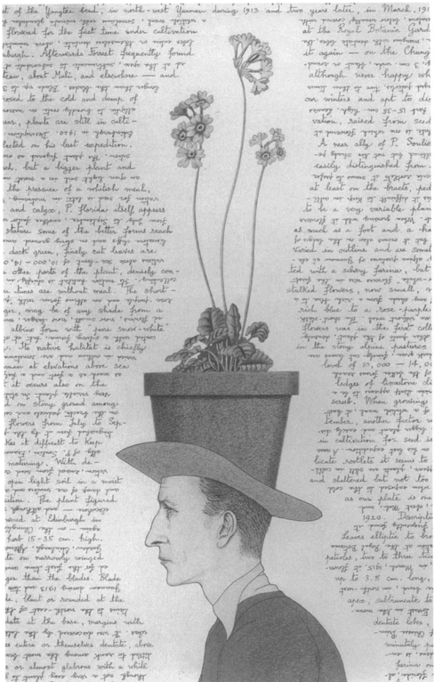

BarnebyLives! is an R program which serves to help botanical collectors in Western North America. BarnebyLives! runs multiple types of queries to acquire political and administrative, geographic, and taxononomic data for recently collected herbarium specimens. It also has limited abilities to search for taxonomic synonyms, check spelling of family, genus, and species names, as well as author abbreviations.  

BarnebyLives! serves the entirety of the flora of Western North America West, which coincides with the Mississippi River. It also includes the entirety of the state of Illinois, and portions of Indiana. However, the area is bounded on it's North by Canada and South by Mexico, essentially it covers the western portion of the Conterminous United States (which excludes Alaska). While it covers this range, most variables are focused on supporting botanists working West of the Colorado Front Range, especially those operating on Bureau of Land Management and Forest Service lands.

BarnebyLives! Is meant to supplement, not supplant, collectors field note endeavors. Variables which BarnebyLives! may produce for each collection includes:

**Political**  
- State  
- County   
- Township  
- Public Land Survey System (township, range, section)  

**Geographic**
- Mountain Range (if relevant)  
- Nearest GNIS place name, and azimuth from it  

**Site characteristics**  
- Elevation (both meters and feet)  
- Slope  
- Aspect  
- Surficial geology  
- Geomorphon  

**Taxonomic**  
- Searches for synonym to species  
- Quick spell check for Family, Genus, and specific epithet 
- Consults taxonomic authors abbreviations to ensure correct spelling 

**Directions**  
- directions to a parking spot can be acquired from Google Maps; however this implies the location can be driven to in the first place. This will require interactive alterations from the user. 

**Other features include**   
- Date parsing, e.g. convert date into congruent museum formats (month in roman numerals)  
- Conversion of Degrees Minutes Seconds (DMS) to Decimal Degrees (DD; )  
- Exporting collection data as a 'shapefile' or KML for use in a GIS or GoogleEarth

If the datasheet which is submitted to BarnebyLives! contains text in a cell, the program WILL NOT BE QUERIED for that variable if it is under 'Site Characteristics'. 

Currently BarnebyLives! Is being run on a juiced up computer either in Rogers Park Chicago or Reno. The amount of data which it queries is very large. Please let me know if you have a query and I will run it for you. If you only collect from a smaller portion of the West, e.g. a certain state, or FS/BLM Unit/Field Office, you should be able to set up a local instance. Although, the documentation for such an endeavor is nascent the endeavor is simple, see "crop2boundary" for the workflow. 

## Installation

BarnebyLives! is in beta testing, and can currently only be installed as 0.1.0 from github. 
```r
devtools::install_github('sagesteppe/BarnebyLives')
```
We hope to collaborate with others to treat CONUS and to create multiformat data e.g. Darwincore, CPNWH, etc., and push this product onto CRAN as well as publish a short piece in APPS! It is on the backburner, but still simmering! Stay tuned in but dropped out!

## Geodata directory structure

```
geodata
├── allotments
├── aspect
├── elevation
├── geology
├── geomorphons
├── mountains
├── pad
├── places
├── plss
├── political
└── slope
```

## Chicago Botanic Garden Fieldworkers Usage

There are multiple ways to submit jobs to BarnebyLives! One method is to submit your herbarium data collection sheet via email to me. The preferred method is to enter your data onto [Google Sheets](https://docs.google.com/spreadsheets/d/1iOQBNeGqRJ3yhA-Sujas3xZ2Aw5rFkktUKv3N_e4o8M/edit#gid=0). You will need to be added as a user for this. Contact my @chicagobotanic.org for this. This project contains 3 tabs 
- definitions of all fields which can be filled  (Data Definitions)  
- examples of real (my) collections for 2023 to base your work off (Data Entry - Examples)  
- user submittal sheet  (Data Entry)  
- an example of the text output which will be generated (Processed - Examples)
- the text output which is generated for queries (Processed)


There are two colors on this sheet. White (or Black in dark mode) are cells which cannot be derived via the program. Blue cells are optional, or otherwise not required. 

### Usage Process

Allow up to 1 month of processing time for a request. You should be working on labels throughout the season. Your submittal will be ran within a couple weeks.  The results will be populated in the sheet 'Processed', you will need to manually review/edit them, once you are satisfied and made the required alterations we will submit them for label generation.


*BarnebyLives! Was named after Rupert Charles Barneby, botanist extraordinaire, artist, socialite, and kind hearted human being. He is the hero the West needs not Hayduke. Hence, BarnebyLives!*


