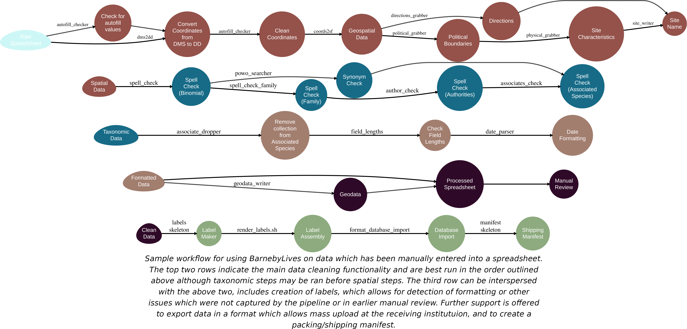

---
output:
  md_document:
    variant: gfm
html_preview: false
---

<!-- README.md is generated from README.Rmd. Please edit that file -->

```{r, echo = FALSE, results='asis'}
cat(
	badger::badge_codefactor('sagesteppe/eSTZwritR'), 
	badger::badge_repostatus("Active")
)
```

## Overview 

BarnebyLives! is an R program which serves to help botanical collectors in Western North America. BarnebyLives! runs multiple types of queries to acquire political and administrative, geographic, and taxonomic data for recently collected herbarium specimens. It also has limited abilities to search for taxonomic synonyms, check spelling of family, genus, and species names, as well as author abbreviations.  

BarnebyLives! serves the entirety of the flora of the western conterminous US, which coincides with the Mississippi River. It also includes the entirety of the state of Illinois, and portions of Indiana. However, the area is bounded on it's North by Canada and South by Mexico, essentially it covers the western portion of the Conterminous United States (which excludes Alaska). While it covers this range, most variables are focused on supporting botanists working West of the Rocky Mountain Front Range, especially those operating on Bureau of Land Management and Forest Service administered lands.

BarnebyLives! Is meant to *supplement*, not supplant, collectors field note endeavors. Variables which BarnebyLives! may produce, automatically, for each collection includes:

**Political**  
- State  
- County   
- Township  
- Public Land Survey System (township, range, section)  

**Geographic**
- Mountain Range (if relevant)  
- Nearest Geographic Names Information System (GNIS) place name, and distance and azimuth from it  

**Site characteristics**  
- Elevation (both meters and feet)  
- Slope  
- Aspect  
- Surficial geology  
- Geomorphon (major landform elements) 

**Taxonomic**  
- Spell check for Family, Genus, and specific epithet 
- Searches for synonym to species  
- Spell checks taxonomic authorities
- Spell check for associated species

**Directions**  
- directions to a parking spot can be acquired from Google Maps; however this implies the location can be driven to in the first place.

**Other features include**   
- Date parsing, e.g. convert date into congruent museum formats (month in European style)  
- Conversion of Degrees Minutes Seconds (DMS) to Decimal Degrees (DD)  
- Exporting collection data as a 'shapefile' or KML for use in a GIS or GoogleEarth

**Label and shipping manifest generation**
- Herbarium Labels which autopopulate from the script output
- Manifests which autopopulate from the script outputs
- Herbarium labels with retro dot municipality maps

**Electronic data for mass digital specimen upload**
- Puts out data in formats congruent with Symbiota, Darwincore, Rocky Moutain Herbarium, and Consortium of Pacific Northwest Herbaria. 

Currently BarnebyLives! Is being run on a juiced up computer either in Rogers Park Chicago or Reno. The amount of data which it queries is very large. Please let me know if you have a query and I will run it for you. If you only collect from a smaller portion of the West, e.g. a certain state, or FS/BLM Unit/Field Office, you should be able to set up a local instance. Although, the documentation for such an endeavor is nascent the endeavor is simple, see "crop2boundary" for the workflow. 

## Installation

BarnebyLives! is in beta testing, and can currently only be installed as 0.1.0 from github. 
```r
devtools::install_github('sagesteppe/BarnebyLives')
```
The generation of labels will requires that Rmarkdown is succesfully set up to render to PDF via a LaTeX distribution such as pdflatex, lualatex, xelatex.

Labels will further require two programs, pdfjam and pdftk. These can be installed on Debian flavors of Linux as so:
```sh
sudo apt-get update
sudo apt-get install pdfjam -y
sudo apt-get install pdftk -y
```

We hope to collaborate with others to treat CONUS and to create multiformat data e.g. Darwincore, CPNWH, etc., and push this product onto CRAN as well as publish a short piece in APPS! It is on the backburner, but still simmering! Stay tuned in but dropped out!

## Input Data Column Names

The columns in the top table are **required** to run the all the functions in BarnebyLives. The columns in the middle table are suggested to increase the quality of the collections.  The columns in the lower table are optional, to be blunt, BarnebyLives will generate all of these values. Ficticious examples are provided here, while links to real examples (over 100) are contained [here](https://docs.google.com/spreadsheets/d/1iOQBNeGqRJ3yhA-Sujas3xZ2Aw5rFkktUKv3N_e4o8M/edit#gid=0) and in the vignettes.

|     Column name        |  Description  |   Example   |
|   -----------------    | ------------- |  ---------- |
|    Collection_number   | The collection number for the primary botanist. This number should unambiguously identify the collection, and be inclusive of all replicates (multiple herbaria sheets). We recommend using a number agnostic of projects and seasons. | 6359 |
|    Primary_Collector    | The botanist who assumes primary responsibility for collecting, processing, and coordinating the accessioning of the collection with herbaria. | Rupert Barneby | 
|   Associated_Collectors | Other collectors who were present at the time of collection, and contributed to the process. | Dwight Ripley | 
|        Full_name        | The full scientific name of the taxonomic entity, by neccessity including the Genus and Epithet which form a binomial, and information on infraspecies. | Astragalus tephrodes var. eurylobus |
|        Latitude         | The decimal degrees (dd) or degrees minutes seconds (dms) perpendicular to the equator which the collection was made at. | 37.6415 |
|        Longitude        |  The decimal degrees (dd) or degrees minutes seconds (dms) along the equator which the collection was made at. | -114.4985 |
|       Date_digital      |  The date which the collection was made in American format, 'mm.dd.yyyy' for example, '01.02.2023' is January 2nd. | 06.18.1944 |
|        Vegetation       | Plant species which are present with high amounts of biomass, or which are postulated to be keystone species etc. |  Artemisia nova, Pleuraphis jamesii |
|        Associates       | Other plant species growing in the area which do not compose the dominant amounts of biomass. | Brickellia longifolia  |
|         Habtiat         | Notes on the abiotic  (landform, soil texture, etc.) and biotic (landcover type 'forest', 'riparian' etc.) setting which the collection was growing in. | Ridges of barren alkaline hills  |
|          Notes          | Any notes, especially relevant are those describing growth form, floral colour, scents, or textures. | petals pink purple  |

Suggested columns! 

|     Column name        |  Description  |    Example   |
|   -----------------    | ------------- |  ----------  |
|          Fide           | The most authoritative Flora, or monograph, used to identify the collections. | Intermountain Flora |
|       Determined_by     | A botanist who verified the identity of the collection. |  Rupert Barneby   |
|     Determined_date     | The date the botanist determined the specimen. This beginning a chain of annotations for the distant future. |   06.18.1944 |
|    Tissue_collections   |  Number of individual plants from which tissue collections were made. |  0  |
|       Project_name      | The endeavor which this collection was made for, or which field work may be associated with. | Flora Nevadensis |
|        Site_name        |  A user defined name for the locality from which collections were made.  | Caliente |

Unnecessary columns!

|     Column name        |  Description  |
|   -----------------    | ------------- |
|          Genus          | The Genus which the species is a component of |  Astragalus |
|         Species         | The Species which the population from which the collection was made is a component of. |  tephrodes  |
|       Name_authority    | The full scientific name of the taxonomic entity, by neccessity including the Genus and Epithet which form a binomial, and information on infraspecies and authors |  A. Gray  |
|     Binomial_authority  | The scientific authors who conceptualized the species, and described it, and if relevant  the authors whom have transferred the species to it's current genus. | 
|         Infrarank       | The taxonomic level nested within Species which this population is a component of, generally one of either 'var.'  or 'ssp.' for variety of subspecies respectively. |
|        Infraspecies     | The taxonomic entity which this population is a component of within the hierarchy of species.  |
| Infraspecific_Authority | The scientific authors who conceptualized the species, and described it, and relevant authors whom have transferred the species to within a species. |
|          Family         | A Family which the Genus which this species is apart of is considered to be a component of. |
|          Datum          |  A smoothed model of the earths surface and reference locations on the surface to measure from (~i.e. meridians). Typical geodetic datums include 'WGS 84', 'NAD 83'. |
|          Aspect         | The measured or in-field estimated cardinal direction which the population faced. |
|          Slope          | The measured or in-field estimated slope which the population faced. |


## General Workflow 

 

## Geodata directory structure
For those that are setting up a local instance the directory structure for the geodata is flat. 
```
$ tree -d
geodata
├── allotments
├── aspect
├── elevation
├── geology
├── geomorphons
├── mountains
├── pad
├── places
├── plss
├── political
└── slope
```
Several of these sub-directories are quite large. In total my local instance takes up around 16gb of data.

```
$ du -h
708M	./geology
73M	./political
3.8M	./mountains
136M	./allotments
435M	./pad
4.6G	./slope
81M	./places
816M	./plss
4.2G	./elevation
4.1G	./aspect
455M	./geomorphons
16G	.
```
As you can see the data regarding site physical characteristics take up most of space. 
Because of this you can download data to a directory which you find suitable.
Personally, I slap all of them on an hdd.

## Rendering Labels

You will need to print you labels for the sheets. We do so as follows. 

a bash loop, such as this, works to combine the labels - 4 per page. 
```
files=(raw/*)
for (( i=0; i<${#files[*]}; i+=4 ));
do
  filename="${files[i]##*/}"
	pdfjam "${files[@]:$i:4}" --nup 2x2 --landscape --outfile "processed/$filename" --noautoscale true  
done
```

obviously the pages of labels can then be combined, like this, to create a single print job. 
```
files=(processed/*)
pdftk ${files[*]} output final/labels.pdf
```
We have this functionality contained within a bash script which is distributed with the package, 'render_labels'. 
Which takes a single argument 'collector' e.g. 'collector=Dwight'. 
We've had difficulty calling this script from it's default install location :/, but it can easily be copied elsewhere and ran from that location. 
It's easy to find this (and where the default herbarium label templates are, which you can totally modify :-)), in R using the following command. 
Obviously this file can then be copied to another location (from within R) and ran... 

```
p2script <- paste0(.libPaths()[ 
  grepl(paste0(version$major, '.', sub('\\..*', "", version$minor)), 
        .libPaths())], '/render_labels.sh')
file.copy(p2script, destination)
```

You can run the script like this...
```
bash path2file/render_labels.sh collector='Dwight'
```
reminder, you only need to chmod +x a file if you don't call 'bash' at the start of an argument...
```
chmod +x render_labels.sh
path2file/render_labels.sh collector='Dwight'
```
Also a reminder that you can check your paths via `$PATH`, and can install to somewhere on your path! e.g. '/usr/local/bin', after that you can simply call it...
```
render_labels.sh collector='Dwight'
```
In all instances the script is meant for you to call it from the following location:
```
├── HerbariumLabels
│  ├── final
│  └── raw ## <- call render_labels.sh from here!!!
│       └── Dwight-raw
```
The labels will end up in 'Final' and the subfolder within raw ('Dwight-raw') will be deleted.
If you want to re-render you'll need to run the purrr::walk again. 

Note that the 'collector' will need to match (..exactly...) the output of the purrr::walk files collector name. 

## Chicago Botanic Garden Fieldworkers Usage

There are multiple ways to submit jobs to BarnebyLives! One method is to submit your herbarium data collection sheet via email to me. The preferred method is to enter your data onto [Google Sheets](https://docs.google.com/spreadsheets/d/1iOQBNeGqRJ3yhA-Sujas3xZ2Aw5rFkktUKv3N_e4o8M/edit#gid=0). You will need to be added as a user for this. Contact my @chicagobotanic.org for this. This project contains 3 tabs 
- definitions of all fields which can be filled  (Data Definitions)  
- examples of real (my) collections for 2023 to base your work off (Data Entry - Examples)  
- user submittal sheet  (Data Entry)  
- an example of the text output which will be generated (Processed - Examples)
- the text output which is generated for queries (Processed)


There are two colors on this sheet. White (or Black in dark mode) are cells which cannot be derived via the program. Blue cells are optional, or otherwise not required. 

### Usage Process

Allow up to 1 month of processing time for a request. You should be working on labels throughout the season. Your submittal will be ran within a couple weeks.  The results will be populated in the sheet 'Processed', you will need to manually review/edit them, once you are satisfied and made the required alterations we will submit them for label generation.

|  | 
|:--:| 
| *'Portrait of Rupert Barneby'* Dwight Ripley (1955) |

*BarnebyLives(!) Was named after Rupert Charles Barneby, botanist extraordinaire, artist, socialite, and kind hearted human being. He is the hero the West needs not Hayduke. Hence, BarnebyLives!*
