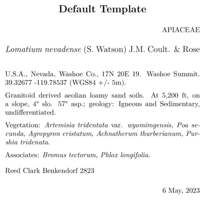
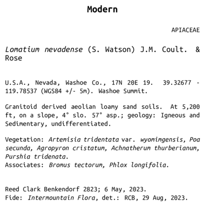

# Built in templates

## Overview

BL has seven standard templates - further details on several of them are
in other vignettes.

Several of these templates (which I interchangeably call ‘skeletons’,
especially in code) are included in vignettes. The `SOS template` is
used as an example for basic label customization in [Customizing a label
template](https://sagesteppe.github.io/BarnebyLives/articles/customizing_a_label_template.html).
Details and notes on using both the `custom fonts` skeletons are in
[Customizing label
fonts](https://sagesteppe.github.io/BarnebyLives/articles/custom_label_fonts.html).
And `maps`, and `logos` are both treated in [Labels with
graphics](https://sagesteppe.github.io/BarnebyLives/articles/labels_with_graphics.html)

## Label templates need to copied from the r package to a local location on the users computer.

You can copy all at once, as shown below, or copy them one at a time as
shown in other vignettes.

``` r
p2lib <- file.path(
  system.file(package = 'BarnebyLives'),
  'rmarkdown', 'templates', 'labels', 'skeleton'
  )
templates <- list.files(p2lib)
templates
```

Use map to copy all of the skeletons.

``` r
Map(file.copy, 
    from = file.path(p2lib, templates), 
    to = file.path(local, templates)
    )

rm(templates)
```

## Default

skeleton-default.Rmd



*Resarch*

  

1.  skeleton-default.Rmd

- [code](https://github.com/sagesteppe/BarnebyLives/blob/main/inst/rmarkdown/templates/labels/skeleton/skeleton-default.Rmd)
- Useful for most collections
- Detail light

  

## Research

skeleton-research.Rmd

  
  

2.  skeleton-research.Rmd

- [code](https://github.com/sagesteppe/BarnebyLives/blob/main/inst/rmarkdown/templates/labels/skeleton/skeleton-research.Rmd)
- Useful for herbarium collections which will serve as vouchers for
  systematics projects.
- Detail heavy

  

## Seeds of Success

skeleton-SOS.Rmd

The SOS label was the original template, and is clearly closely related
to the Scientific label.


*Seeds of Success*

  

3.  skeleton-SOS.Rmd

- [code](https://github.com/sagesteppe/BarnebyLives/blob/main/inst/rmarkdown/templates/labels/skeleton/skeleton-SOS.Rmd)
- Designed for use with a specific U.S. government program, similar to
  research skeletons.
- Detail heavy

  

## Modern

skeleton-modern.Rmd



*Modern*

  

4.  skeleton-modern.Rmd

- [code](https://github.com/sagesteppe/BarnebyLives/blob/main/inst/rmarkdown/templates/labels/skeleton/skeleton-modern.Rmd)
- A mid-century look
- Balances details and aesthetics.

  

## Custom fonts

skeleton-customfont.Rmd


*Map*

\<br

5.  skeleton-customfont.Rmd (& skeleton-customfont-downloaded.Rmd)

- [code](https://github.com/sagesteppe/BarnebyLives/blob/main/inst/rmarkdown/templates/labels/skeleton/skeleton-customfont.Rmd)
- [code](https://github.com/sagesteppe/BarnebyLives/blob/main/inst/rmarkdown/templates/labels/skeleton/skeleton-customfont-downloaded.Rmd)
- Both based on the research/SOS templates, modified YAML headers to
  make using specific fonts easier.

  

## Maps

skeleton-maps.Rmd


*Map*

  

6.  skeleton-maps.Rmd

- [code](https://github.com/sagesteppe/BarnebyLives/blob/main/inst/rmarkdown/templates/labels/skeleton/skeleton-maps.Rmd)
- Banger of a mid-century classic, BL also has the functions to create
  the maps.

  

## Logos

skeleton-logo.Rmd


*Logo*

7.  skeleton-logo.Rmd

- [code](https://github.com/sagesteppe/BarnebyLives/blob/main/inst/rmarkdown/templates/labels/skeleton/skeleton-logo.Rmd)
- *caveat emptor* I’ve always preferred stamped on institution logos,
  but to each their own.  
- Detail light

  
