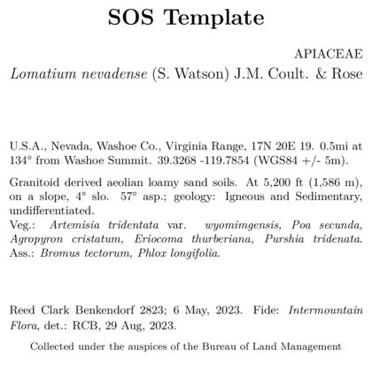

# Customizing a label template

## Overview

Obviously, everyone wants to be able to customize their label templates!
Why go through the bother of installing and running `BarnebyLives` if
you cannot do that. So here are a couple examples of tweaking around
with one of the default skeletons to get some labels which may be better
suited to an institutions style.

Note that the labels are made using LaTeX, an awesome guide for LaTeX
(relevant to the level you will be using it at) is
[Overleaf.org](https://www.overleaf.com/learn/latex/Learn_LaTeX_in_30_minutes),
and check the links in the side bar too!

## Modifications

``` r
library(BarnebyLives)
library(tidyverse)

local <- file.path('~', 'Documents', 'assoRted', 'Barneby_Lives_dev', 'LabelStyles')

l.nevadense <- collection_examples |>
  filter(Collection_number == 2823)

write.csv(l.nevadense, file.path(local, 'SoS-ExampleCollection.csv'))
```

As a reminder labels can be copied from their original locations, in the
package installation, using the following code.

``` r
p2lib <- file.path(
  system.file(package = 'BarnebyLives'),
  'rmarkdown', 'templates', 'labels', 'skeleton'
  )

# here we copy over one of the skeletons which we are going to modify in this example
file.copy(
  from = file.path(p2lib, 'SoS-skeleton.Rmd'), 
  to = file.path(local, 'SoS-skeleton.Rmd')
  )

rm(p2lib)
```

When using the program you will need to copy a template from it’s
location within the package to a ‘local’ location. This is because you
will *always* need to modify a small part of the skeleton which defines
where the document should *look* for your data it will put on the
labels, see the ‘creating_labels’ vignette for details. Any changes you
make to the skeletons in the package directory will be lost anytime you
update the package. Once the file is in that location it can easily be
opened for safe editing.

By ‘local’ I basically mean put the file in a location on your computer
which will not be overwritten when you update the package.  
Obviously it’s good to try and place all of these skeletons in the same
location so you don’t have to do much hunting around to find them.

While I am about to be very busy for the next few years I am happy to
accept pull requests so that BL has a greater variety of herbarium
templates, likewise you can make your own `writer_*` type functions and
push those to the package. If you have questions about how to do this,
many good github resources/guides exist, and I am happy to try and help
with incorporating materials.

One final note is that LaTeX uses *spaces*, or ’ ’ for controlling
content. In particular two spaces will force the text onto a new line.
It is hard for me illustrate these in the examples, but I’ll try and do
my best to mention them when relevant.

For this example we will focus on the final default template, which is a
pretty middle of the road design.


*Default SOS template results*

  

Hmm that’s a busy label, we could try and reduce the directions
manually… Or, we can just rid of them! Around line 50 in the skeleton we
can just remove the following details.

``` r
\begingroup
\begin{spacing}{0.02}
{\scriptsize `r record[['Directions_BL']]`}
\end{spacing}
\endgroup
```

Delete this!

  



*No directions*

  

This label without directions looks better! But now that we have more
space available to work with I now want to open up some space between
the habitat notes and vegetation information. Doing that is simple, all
we need is to empty a blank line into the document between
`writer(data$habitat)` and `data$physical_environ` blocks. Below is a
reprodcution of the document as it looks.

``` r
\begingroup
\small
`r record[['Gen']]`. `r writer(record[['Site']])` `r record[['latitude_dd']]` `r record[['longitude_dd']]` (`r record[['Datum']]` `r writer(record[['Coordinate_uncertainty']])`).

`r writer(record$Habitat)`. `r record[['physical_environ']]`  
Veg.: `r species_font(record[['Vegetation']])` `r associates_writer(record[['Associates']])`
`r writer(record[['Notes']])`  
\endgroup
```

And below is the skeleton with the line inserted.

``` r
\begingroup
\small
`r record[['Gen']]`. `r writer(record[['Site']])` `r record[['latitude_dd']]` `r record[['longitude_dd']]` (`r record[['Datum']]` `r writer(record[['Coordinate_uncertainty']])`).


`r writer(record$Habitat)`. `r record[['physical_environ']]`  
## line is here
Veg.: `r species_font(record[['Vegetation']])` `r associates_writer(record[['Associates']])`
`r writer(record[['Notes']])`  
\endgroup
```


*Space between habitat and vegetation*

  
Which results in the label above, with a new space

> All I want is to breathe - I’m too thin Won’t you breathe with me?  
> Find a little space, so we can move in-between - in-between it  
> And keep one step ahead, of yourself.

  
Now let’s change the line that controls the size of the font for the
project name. Here we will be making the font size smaller by shifting
from the `LARGE` to the `large` TeX arguments.

``` r
\textbf{\LARGE `r record[['Project_name']]`}
```

``` r
\textbf{\large `r record[['Project_name']]`}
```


*Smaller project name*

  

Now let’s change the location of the family on the label (which is
currently right aligned), to a left alignment.

``` r
\begin{center}
\textbf{\LARGE `r record[['Project_name']]`}
\end{center}
\vspace{-\baselineskip} 
\begin{flushright} # gonna change this. 
\uppercase{`r record[['Family']]`}
\end{flushright} # and this
\vspace{-\baselineskip} 
\begingroup
```

If you remove the `flushright` commands this part of you skeleton will
look this this:

``` r
\begin{center}
\textbf{\LARGE `r record[['Project_name']]`}
\end{center}
\vspace{-\baselineskip} 
\uppercase{`r record[['Family']]`}
\vspace{-\baselineskip} 
\begingroup
```

The image below shows a label where the family name has been moved from
right to left alignment.


*Family to the left*

  

We may also decide that we want to put determination information right
under the species information. We can do that by just moving these
elements around. (Be sure to delete the call to `writer_fide` from the
chunk located all the way near the bottom of the skeleton so that the
identification information isn’t rendered twice!).

So copy the `writer_fide(data)` from down near the bottom of the
skeleton:

``` r
\begingroup
\small
`r collection_writer(record)`. `r writer_fide(record)`
\endgroup
```

And bring it up to where the scientific name is printed. We will also
make the text smaller.

``` r
\begingroup
\large
`r writer(paste(record[['Genus']], record[['Epithet']]), italics = TRUE)` ...
\normalsize 
`r writer_fide(record)`
\endgroup
```


*Determination at top of label*

  

Obviously, the way I enter data for determination would be bad for this!
Using my initials after my full name makes sense, in this context, who
the hell is “RCB” you would wonder?

## In summary

Just bear in mind you can make big changes to labels with small steps!
The overleaf guide has <https://www.overleaf.com/learn> everything you
need, and you’ll probably realize this pales in comparison.
