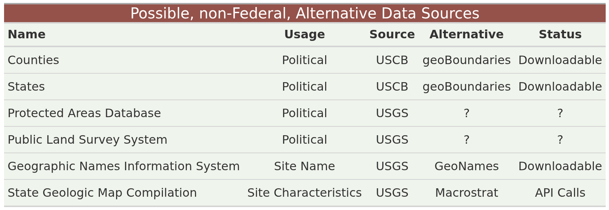

# Alternative Data Sources

BarnebyLives relies on considerable amounts of data developed,
maintained, and downloaded from the US Federal Government. However,
concerns exist regarding the availability of spatial data from the US
Federal Government. Here, we list the sources of data used by BL,
indicating which are sourced directly from the federal government, and
when possible, list alternatives that may need to be used as drop-in
replacements.

Please note that because BL utilizes local compute, these data sources
being removed by the Federal government will not effect existing
instances

Data Sources
