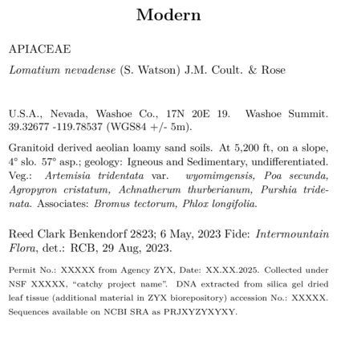
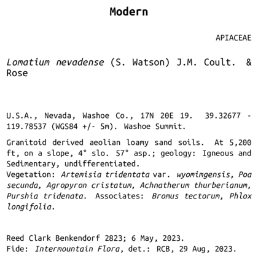

```{r setup, include=FALSE}
knitr::opts_chunk$set(eval = FALSE)
knitr::opts_chunk$set(message = FALSE)
knitr::opts_chunk$set(warning = FALSE)
```

```{r load libraries and find labels, eval =F, echo = F}
#devtools::install_github('sagesteppe/BarnebyLives')
library(BarnebyLives)
library(tidyverse)

local <- file.path(path.expand('~'), 'Documents', 'assoRted', 'Barneby_Lives_dev', 'LabelStyles')
l.nevadense <- collection_examples |>
  filter(Collection_number == 2823) |>
  mutate(
    Project_name = 'Research Notes', 
    Coordinate_uncertainty = '+/- 5m', 
    Research_notes = 'Permit No.: XXXXX from Agency ZYX, Date: XX.XX.2025. Collected under NSF XXXXX, "catchy project name". DNA extracted from silica gel dried leaf tissue (additional material in ZYX biorepository) accession No.: XXXXX. Sequences available on NCBI SRA as PRJXYZYXYXY.'
    )

write.csv(l.nevadense, file.path(local, 'SoS-ExampleCollection.csv'), row.names = F)

p2lib <- file.path(
  system.file(package = 'BarnebyLives'),
  'rmarkdown', 'templates', 'labels', 'skeleton'
  )
```

## Overview 

BL has six major standard templates - further details on several of them are in other vignettes. 
For example 1) `maps`, 2) `logos` are treated in `Custom label logos and maps`, and customizing two additional basic skeletons is treated in 3) `custom label fonts`. 
This is a brief overview of what the 4) `modern`, 5) `research`, 6) `SOS` templates look like. 

## Research Label

Label templates can be copied from their original locations to a more common directory for a user to interface with.

```{r copy templates to local directory, eval = F, message=F}
f <- c('skeleton-research.Rmd', 'skeleton-modern.Rmd')

Map(file.copy, from = file.path(p2lib, f), to = file.path(local, f))

rm(f)
```

```{r actually render labels, echo = F, eval = F}
purrr::walk(
  .x = l.nevadense$Collection_number,
  ~ rmarkdown::render(
    input = file.path(local, 'skeleton-research.Rmd'), 
    output_file = file.path(local, paste0('research', glue::glue("{.x}.pdf"))), 
    params = list(Collection_number = {.x}) 
  )
)
```

  
<br>

## Modern label

```{r actually render labels, echo = F, eval = F}
l.nevadense <- l.nevadense |>
  mutate( Project_name = 'Modern' )

write.csv(l.nevadense, file.path(local, 'SoS-ExampleCollection.csv'), row.names = F)

purrr::walk(
  .x = l.nevadense$Collection_number,
  ~ rmarkdown::render(
    input = file.path(local, 'skeleton-modern.Rmd'), 
    output_file = file.path(local, paste0('modern', glue::glue("{.x}.pdf"))), 
    params = list(Collection_number = {.x}) 
  )
)
```


  

## Seeds of Success template

