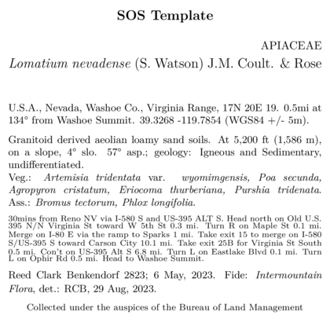

```{r setup, include=FALSE}
knitr::opts_chunk$set(eval = FALSE)
knitr::opts_chunk$set(message = FALSE)
knitr::opts_chunk$set(warning = FALSE)
knitr::opts_chunk$set(comment = "")
```

```{r load libraries and find labels, eval =F, echo = F}
#devtools::install_github('sagesteppe/BarnebyLives')
library(BarnebyLives)
library(tidyverse)

local <- file.path(path.expand('~'), 'Documents', 'assoRted', 'Barneby_Lives_dev', 'LabelStyles')
l.nevadense <- collection_examples |>
  filter(Collection_number == 2823) |>
  mutate(
    Project_name = 'Research Notes', 
    Coordinate_uncertainty = '+/- 5m', 
    Research_notes = 'Permit No.: XXXXX from Agency ZYX, Date: XX.XX.2025. Collected under NSF XXXXX, "catchy project name". DNA extracted from silica gel dried leaf tissue (additional material in ZYX biorepository) accession No.: XXXXX. Sequences available on NCBI SRA as PRJXYZYXYXY.'
    )

write.csv(l.nevadense, file.path(local, 'SoS-ExampleCollection.csv'), row.names = F)
```

## Overview 

BL has seven standard templates - further details on several of them are in other vignettes. 

Several of these templates (which I interchangeably call 'skeletons', especially in code) are included in vignettes. 
The `SOS template` is used as an example for basic label customization in [Customizing a label template](https://sagesteppe.github.io/BarnebyLives/articles/customizing_a_label_template.html). 
Details and notes on using both the `custom fonts` skeletons are in [Customizing label fonts](https://sagesteppe.github.io/BarnebyLives/articles/custom_label_fonts.html). 
And `maps`, and `logos` are both treated in [Labels with graphics](https://sagesteppe.github.io/BarnebyLives/articles/labels_with_graphics.html)

## Label templates need to copied from the r package to a local location on the users computer. 

You can copy all at once, as shown below, or copy them one at a time as shown in other vignettes. 
```{r copy templates to local directory, eval = F, message=F}
p2lib <- file.path(
  system.file(package = 'BarnebyLives'),
  'rmarkdown', 'templates', 'labels', 'skeleton'
  )
templates <- list.files(p2lib)
templates
```

Use map to copy all of the skeletons.  

```{r show template names, eval = F, message=F}
Map(file.copy, 
    from = file.path(p2lib, templates), 
    to = file.path(local, templates)
    )

rm(templates)
```

```{r actually render labels, echo = F, eval = F}
purrr::walk(
  .x = l.nevadense$Collection_number,
  ~ rmarkdown::render(
    input = file.path(local, 'skeleton-research.Rmd'), 
    output_file = file.path(local, paste0('research', glue::glue("{.x}.pdf"))), 
    params = list(Collection_number = {.x}) 
  )
)
```


## Default

skeleton-default.Rmd

  

<br> 

1) skeleton-default.Rmd
  + [code](https://github.com/sagesteppe/BarnebyLives/blob/main/inst/rmarkdown/templates/labels/skeleton/skeleton-default.Rmd) 
  + Useful for most collections 
  + Detail light 
  
<br> 

## Research 

skeleton-research.Rmd

  
<br>

2) skeleton-research.Rmd
  + [code](https://github.com/sagesteppe/BarnebyLives/blob/main/inst/rmarkdown/templates/labels/skeleton/skeleton-research.Rmd) 
  + Useful for herbarium collections which will serve as vouchers for systematics projects. 
  + Detail heavy 

<br> 

## Seeds of Success 

skeleton-SOS.Rmd

The SOS label was the original template, and is clearly closely related to the Scientific label. 

  

<br>

3) skeleton-SOS.Rmd
  + [code](https://github.com/sagesteppe/BarnebyLives/blob/main/inst/rmarkdown/templates/labels/skeleton/skeleton-SOS.Rmd)
  + Designed for use with a specific U.S. government program, similar to research skeletons. 
  + Detail heavy 
  
<br> 

## Modern 

skeleton-modern.Rmd

```{r actually render labels 2, echo = F, eval = F}
l.nevadense <- l.nevadense |>
  mutate( Project_name = 'Modern' )

write.csv(l.nevadense, file.path(local, 'SoS-ExampleCollection.csv'), row.names = F)

purrr::walk(
  .x = l.nevadense$Collection_number,
  ~ rmarkdown::render(
    input = file.path(local, 'skeleton-modern.Rmd'), 
    output_file = file.path(local, paste0('modern', glue::glue("{.x}.pdf"))), 
    params = list(Collection_number = {.x}) 
  )
)
```


  

<br>

4) skeleton-modern.Rmd
  + [code](https://github.com/sagesteppe/BarnebyLives/blob/main/inst/rmarkdown/templates/labels/skeleton/skeleton-modern.Rmd)
  + A mid-century look
  + Balances details and aesthetics. 
  
<br> 

## Custom fonts

skeleton-customfont.Rmd

  

<br

5) skeleton-customfont.Rmd (& skeleton-customfont-downloaded.Rmd)
  + [code](https://github.com/sagesteppe/BarnebyLives/blob/main/inst/rmarkdown/templates/labels/skeleton/skeleton-customfont.Rmd)
  + [code](https://github.com/sagesteppe/BarnebyLives/blob/main/inst/rmarkdown/templates/labels/skeleton/skeleton-customfont-downloaded.Rmd)
  + Both based on the research/SOS templates, modified YAML headers to make using specific fonts easier. 

<br> 

## Maps

skeleton-maps.Rmd

  

<br>

6) skeleton-maps.Rmd
  + [code](https://github.com/sagesteppe/BarnebyLives/blob/main/inst/rmarkdown/templates/labels/skeleton/skeleton-maps.Rmd)
  + Banger of a mid-century classic, BL also has the functions to create the maps. 
  
<br> 

## Logos

skeleton-logo.Rmd

    

7) skeleton-logo.Rmd
  + [code](https://github.com/sagesteppe/BarnebyLives/blob/main/inst/rmarkdown/templates/labels/skeleton/skeleton-logo.Rmd)
  + *caveat emptor* I've always preferred stamped on institution logos, but to each their own.  
  + Detail light
  
<br> 
