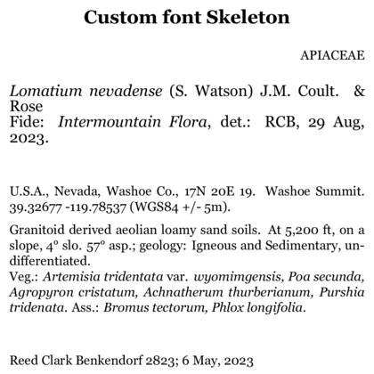
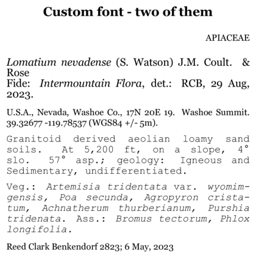

```{r setup, include=FALSE}
knitr::opts_chunk$set(eval = FALSE)
knitr::opts_chunk$set(message = FALSE)
knitr::opts_chunk$set(warning = FALSE)
```

## Overview 
Obviously, everyone wants to be able to customize their label templates! 
Why go through the bother of installing and running `BarnebyLives` if you cannot do that!  

Note that the labels are made using LaTeX, an awesome guide for LaTeX (relevant to the level you will be using it at) is [Overleaf.org](https://www.overleaf.com/learn/latex/Learn_LaTeX_in_30_minutes), and check the links in the side bar too! 

In this vignette we will replace the default LaTeX fonts with add-on fonts using the `fontspec` [package](https://ctan.org/pkg/fontspec?lang=en), an illustrated guide of it's fonts is available [here](https://www.overleaf.com/latex/templates/fontspec-all-the-fonts/hjrpnxhrrtxc).  
Also note that previously you *may* have been able to scrape by using any old LaTeX installation, at this point you will definitely need to make sure you have either XelaTex for lualatext installed. 
'tinytex' which is installable directly from R should accomplish this on all operating systems. 

This vignette assumes you were able to get through `Custom Label Templates`. 

```{r tinytex for all OS, eval = F}
install.packages("tinytex")
tinytex::install_tinytex()
```

You can check that you have successfully installed this with
```{r}
tinytex::is_tinytex()
```


## linux users 

If you are on linux for the sake of compatibility for this vignette, please install some of the Windows fonts. 
It seems most of these are available on Mac - but if you start hitting errors, maybe give this a go. 

You can do this with the code below, which will give part of your soul to Bill Gates of yesteryear. 

```{sh, eval=F}
echo "ttf-mscorefonts-installer msttcorefonts/accepted-mscorefonts-eula select true" | sudo debconf-set-selections
sudo apt install -y ttf-mscorefonts-installer
```

or you can 
```{sh, eval=F}
sudo apt install ttf-mscorefonts-installer
```

and then click `tab` and `enter` on your keyboard when the debconf pops up to accept that you are giving Bill Gates your soul. 
```{sh}
fc-list | grep "Times New Roman"
```

and doubly verify the Tex install can access them
```{sh}
sudo fc-cache -fv
```

You may get messages about loops, these are fine as long as the last line reads something like 

`fc-cache: succeeded`

## Prepare workspace

```{r load libraries and fine labels, eval =F}
library(BarnebyLives)
library(tidyverse)

local <- file.path(
  '~', 'Documents', 'assoRted', 'Barneby_Lives_dev', 'LabelStyles')

l.nevadense <- collection_examples |>
  filter(Collection_number == 2823) |>
  mutate(
    Project_name = 'Custom Fonts', 
    Coordinate_uncertainty = '5m'
    ) 

write.csv(
  l.nevadense, 
  file.path(local, 'SoS-ExampleCollection.csv'),
  row.names = F)
```

All of the labels can be copied from their original locations using the following code.  

```{r copy a template to a local directory, eval = F}
p2lib <- file.path(
  system.file(package = 'BarnebyLives'),
  'rmarkdown', 'templates', 'labels', 'skeleton'
  )

# here we copy over one of the skeletons which we are going to modify in this example
file.copy(
  from = file.path(p2lib, 'skeleton-customfont.Rmd'), 
  to = file.path(local, 'skeleton-customfont.Rmd')
  )

rm(p2lib)
```


## Use a single custom font

Here we will use a custom font that ships with fontspec.

```{r actually render labels, echo = F, eval = F}
purrr::walk(
  .x = l.nevadense$Collection_number,
  ~ rmarkdown::render(
    input = file.path(local, 'skeleton-customfont.Rmd'), 
    output_file = file.path(local, paste0('custom-font', glue::glue("{.x}.pdf"))), 
    params = list(Collection_number = {.x}) 
  )
)

purrr::walk(
  .x = l.nevadense$Collection_number,
  ~ rmarkdown::render(
    input = file.path(local, 'skeleton-customfont-twofonts.Rmd'), 
    output_file = file.path(local, paste0('custom-twofonts', glue::glue("{.x}.pdf"))), 
    params = list(Collection_number = {.x}) 
  )
)

purrr::walk(
  .x = l.nevadense$Collection_number,
  ~ rmarkdown::render(
    input = file.path(local, 'skeleton-customfont-downloaded.Rmd'), 
    output_file = file.path(local, paste0('custom-font-downloaded', glue::glue("{.x}.pdf"))), 
    params = list(Collection_number = {.x}) 
  )
)
```

If you look at the header of the `skeleton-customfont.Rmd` file, you'll notice it has more going on than the other skeletons. 
In particular it has more `header-includes` calls. 
We just want to point this out as you will likely want to merge the components of different label templates together. 

```
output: 
  pdf_document:
    latex_engine: xelatex # or lualatex
    keep_text: true
params:
  Collection_number: Collection_number
geometry: paperheight=4in,paperwidth=4in,margin=0.1in
header-includes:
  - \pagenumbering{gobble}
  - \usepackage{setspace}
  - \usepackage{fontspec}
  - \setmainfont{Georgia}
```

Notice that the last two lines in this *excerpt* of the header `- \usepackage{fontspec}` and `- \setmainfont{Georgia}` are required to use a custom font. 

Note that the last line in the preamble is: \setmainfont{Georgia} this is the command `setmainfont` and we specifying that our mainfont should be changed to 'Georgia'.  

## Examples with Common Fonts

  

<br>

However, we can use multiple fonts (...if so desired... ) by importing an additional font, and specifying where we should use it. 
Note that in our header (again more truncated to highlight the parameters we need to modify) we are also now calling `\newfontfamily\couriernew{Courier New}` which loads and, I believe, aliases the font. 

```
output: 
  ...
header-includes:
  ...
  - \usepackage{fontspec}
  - \setmainfont{Georgia}
  - \newfontfamily\couriernew{Courier New}
```

Once you have the loaded the font via specification in the YAML header, you can specify where it is used using the `\textcouriernew{...}` command. 

```{r multiple fonts 1, eval = F}
...
\textcouriernew{`r writer(data[['Habitat']])`. `r data[['physical_environ']]`}
Veg.: `r species_font(record[['Vegetation']])` `r associates_writer(record[['Associates']])`
`r writer(record[['Notes']])`  
\endgroup
...
```

  

<br>

But! Notice that this new font is applied to the *whole* group not just the braced contents - we can bypass this by specifying the arguments as below. 

```{r multiple fonts 2, eval = F}
...
\textcouriernew{`r writer(data[['Habitat']])`. `r data[['physical_environ']]`}
\endgroup
Veg.: `r species_font(record[['Vegetation']])` `r associates_writer(record[['Associates']])`
`r writer(record[['Notes']])`  
\endgroup
...
```


# downloading fonts 

Individuals may find that fontspec does not have a font to their liking, and may want to supply a custom font. 
A comprehensive guide to do this is located [here](https://www.overleaf.com/learn/latex/Questions/I_have_a_custom_font_I%27d_like_to_load_to_my_document._How_can_I_do_this%3F).  
You should be able to add downloaded fonts to the font directory on your computer and have text find them automatically. 
 
But in this example we will manually download from Google Fonts, and store the font in our project repository so we can load it if from a relative path - a process I think may be easier for some users. 
Note I normally use R to download the fonts etc., but have not tried it with a system this complex. 
We can download the font Nunito from [Google Fonts](https://fonts.google.com/, by following the ('Get Font' -> 'Download all') options. 
If you don't want to download from google, the font is also available in this packages repository. 

We then need to use a relative path in `\setmainfont` to point it to the ttf files, note here we actually have to go on folder into the downloaded font directory and include a trailing '/'. 
```{r downloaded font header, eval = F}
...
  - \usepackage{fontspec}
  - |
    \setmainfont[
      Path = /home/sagesteppe/Documents/assoRted/Barneby_Lives_dev/LabelStyles/Nunito/static/,
      UprightFont = *-Regular,
      ItalicFont = *-Italic,
      BoldFont = *-Bold,
      BoldItalicFont = *-BoldItalic
    ]{Nunito}
---
...
```


Which gets us the following. 

  

<br>
