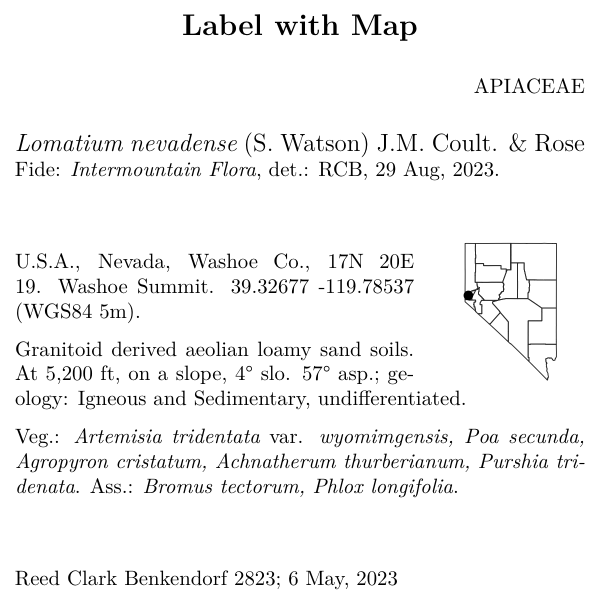
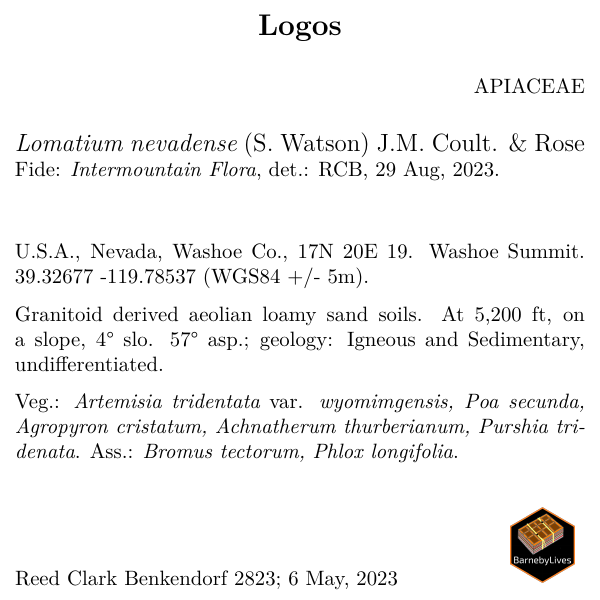

```{r setup, include=FALSE}
knitr::opts_chunk$set(eval = FALSE)
knitr::opts_chunk$set(message = FALSE)
knitr::opts_chunk$set(warning = FALSE)
```

## Overview 
Obviously, everyone wants to be able to customize their label templates! 
Why go through the bother of installing and running `BarnebyLives` if you cannot do that!  

This section is on embedding maps or logos onto labels. 

Note that the labels are made using LaTeX, an awesome guide for LaTeX (relevant to the level you will be using it at) is [Overleaf.org](https://www.overleaf.com/learn/latex/Learn_LaTeX_in_30_minutes), and check the links in the side bar too! 

This vignette assumes you were able to get through `Custom Label Templates`. 

## Prepare workspace

```{r load libraries and find labels, eval =F}
#devtools::install_github('sagesteppe/BarnebyLives')
library(BarnebyLives)
library(tidyverse)

local <- file.path(path.expand('~'), 'Documents', 'assoRted', 'Barneby_Lives_dev', 'LabelStyles')
l.nevadense <- collection_examples |>
  filter(Collection_number == 2823) |>
  mutate(
    Project_name = 'Custom Fonts', 
    Coordinate_uncertainty = '+/- 5m'
  ) 

write.csv(l.nevadense, file.path(local, 'SoS-ExampleCollection.csv'), row.names = F)
```

Label templates can be copied from their original locations using the following code.  

```{r copy a template to a local directory, eval = F}
p2lib <- file.path(
  system.file(package = 'BarnebyLives'),
  'rmarkdown', 'templates', 'labels', 'skeleton'
  )

# here we copy over one of the skeletons which we are going to modify in this example
file.copy(
  from = file.path(p2lib, 'skeleton-maps.Rmd'), 
  to = file.path(local, 'skeleton-maps.Rmd'), 
  overwrite = FALSE
  )

# copy an image to use for a logo
file.copy(
  from = 
    file.path(
    system.file(package = 'BarnebyLives'), 
    'rmarkdown', 'templates', 'transmittal', 'skeleton', 'logo.png'),
  to = file.path(local, 'logo.png')
  )
```

We will also make a map to embed on a label. 
To do this we use the map_maker function. 
Like many things in the package it is an homage to older styles, while aiming to be minimalist and looking good for time to come. 

```{r create map, eval = F}
l.nevadense.sf <- sf::st_as_sf(
  l.nevadense, 
  coords = c('longitude_dd', 'latitude_dd'),
  crs = 4326
  )

geo_path <- '~/Documents/BL_sandbox/geodata'
# create a simple dot map of the state. 
map_maker(
  l.nevadense.sf, 
  path = geo_path, # path for your geographic information. 
  path_out = file.path(local), # where the map will be saved 
  collection_col = 'Collection_number'
  )
```


```{r actually render labels, echo = F, eval = F}
local <- file.path(path.expand('~'), 'Documents', 'assoRted', 'Barneby_Lives_dev', 'LabelStyles')
purrr::walk(
  .x = l.nevadense$Collection_number,
  ~ rmarkdown::render(
    input = file.path(local, 'skeleton-maps.Rmd'), 
    output_file = file.path(local, paste0('map', glue::glue("{.x}.pdf"))), 
    params = list(
      Collection_number = .x, 
      imagepath = file.path(local, 'maps')
      )
   )
)
```

## glimpse at the label skeleton

Embedding images is a pinch more nuanced than some of the other customizations.

```{r header, eval = F}
---
output: 
  pdf_document:
    latex_engine: xelatex # or lualatex
    keep_tex: true
params:
  Collection_number: NULL
  imagepath: NULL # new parameters
geometry: paperheight=4in,paperwidth=4in,margin=0.1in
header-includes:
  - \pagenumbering{gobble}
  - \usepackage{setspace}
  - \usepackage{wrapfig} # new package
---
```

The header in the 'skeleton-maps' document has two additional arguments. 
One an additional parameter specifying the path to a directory containing the map images to include on the image. 
Two, another package used to insert the image, and wrap the text around. 

```{r wrapfig block, eval = F}
\begin{wrapfigure}[5]{r}[0pt]{1in} 
\vspace{-5.0ex} 
\includegraphics[width=1in,height=1in,keepaspectratio]{`r imagepath`} 
\end{wrapfigure}
```

The body of the document has one major block added to it. 
An annotated version is shown below

```{r wrapfig annotated, eval = F}
\begin{wrapfigure}[5]{r}[0pt]{1in} #% wrap text around fig, [5] lines of text,
#% {r} align, [0pt] no additional spacing, {1in} image
\vspace{-5.0ex} #% push the image upwards above it's starting line. 
\includegraphics[width=1in,height=1in,keepaspectratio]{`r imagepath`} #% path to image
\end{wrapfigure}
```

PLEASE NOTE that the [5] argument refers to how many lines of text the image is expected to span. 
People using a smaller font may need to kick that up a notch to [6]. 

You may also notice we use a `\par` command further down in the skeleton. 
`\par` allows for us to force a new paragraph within our group. 
This is just for spacing and style, and is by no means necessary. 

```{r par arg, eval = F}
`r writer(record[['Habitat']])`. `r record[['physical_environ']]` \par
```

and you will then end up with 

  

# Logos

Adding logos or other images to labels does not require their generation via a function, but can overall be more challenging. 
Several parameters in the skeleton file may need to be altered to ensure appropriate placement. 

```{r, eval = F}
\vspace{\fill} 

\noindent
\begin{minipage}[t]{0.8\textwidth} #% - [t] anchor image to top of new portion of page we are cutting out
#% width of new page is total doc * 0.8
  \begingroup
  `r collection_writer(record)`
  \endgroup
\end{minipage}%
\hfill
\begin{minipage}[b]{0.2\textwidth} # image is anchored to bottom of new page, takes up 1/5 of it.
  \includegraphics[width=\linewidth,keepaspectratio]{`r logopath`}
\end{minipage}
```

A path to an image can be hard coded onto the skeleton, of feed in via params, and then label can be moved around as you see fit. 
```{r, eval = F}
file.copy(
  from = file.path(p2lib, 'skeleton-logo.Rmd'), 
  to = file.path(local, 'skeleton-logo.Rmd'), 
  overwrite = FALSE
  )

purrr::walk(
  .x = l.nevadense$Collection_number,
  ~ rmarkdown::render(
    input = file.path(local, 'skeleton-logo.Rmd'), 
    output_file = file.path(local, paste0('logo-', glue::glue("{.x}.pdf"))), 
     params = list(Collection_number = {.x}) 
   )
)
```


  

