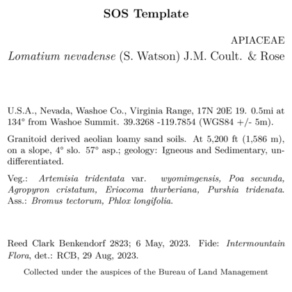
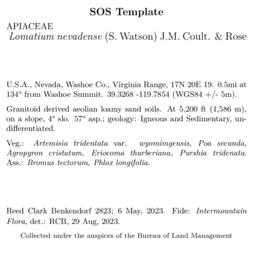
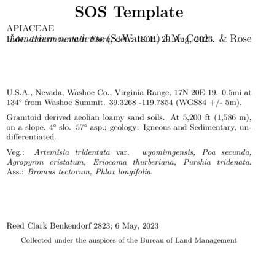

```{r setup, include=FALSE}
knitr::opts_chunk$set(eval = FALSE)
knitr::opts_chunk$set(message = FALSE)
knitr::opts_chunk$set(warning = FALSE)
```

## Overview 
Obviously, everyone wants to be able to customize their label templates! 
Why go through the bother of installing and running `BarnebyLives` if you cannot do that. 
So here are a couple examples of tweaking around with one of the default skeletons to get some labels which may be better suited to an institutions style. 

Note that the labels are made using LaTeX, an awesome guide for LaTeX (relevant to the level you will be using it at) is [Overleaf.org](https://www.overleaf.com/learn/latex/Learn_LaTeX_in_30_minutes), and check the links in the side bar too! 

## Examples 

As a reminder, the standard template (`skeleton.Rmd`) looks like this. 


Another included template, for the Seeds of Success program (`skeletonSOS.Rmd`), looks like this. 
Seeds of Success is a program with the goal of increasing the availability of native seeds for restoration projects, and seed-banking our flora. 


These are two very similar labels, as both types of collections are for immediate research of conservation planning usage.

## Modifications

```{r, eval =F}
library(BarnebyLives)
library(tidyverse)

local <- file.path('~', 'Documents', 'assoRted', 'Barneby_Lives_dev', 'LabelStyles')

l.nevadense <- collection_examples |>
  filter(Collection_number == 2823)

write.csv(l.nevadense, file.path(local, 'SoS-ExampleCollection.csv'))
```

As a reminder labels can be copied from their original locations, in the package installation, using the following code.  

```{r copy a template to a local directory, eval = F}
p2lib <- file.path(
  system.file(package = 'BarnebyLives'),
  'rmarkdown', 'templates', 'labels', 'skeleton'
  )

# here we copy over one of the skeletons which we are going to modify in this example
file.copy(
  from = file.path(p2lib, 'SoS-skeleton.Rmd'), 
  to = file.path(local, 'SoS-skeleton.Rmd')
  )

rm(p2lib)
```

When using the program you will need to copy a template from it's location within the package to a 'local' location. 
This is because you will *always* need to modify a small part of the skeleton which defines where the document should *look* for your data it will put on the labels, see the 'creating_labels' vignette for details. 
Any changes you make to the skeletons in the package directory will be lost anytime you update the package. 
Once the file is in that location it can easily be opened for safe editing. 

By 'local' I basically mean put the file in a location on your computer which will not be overwritten when you update the package.  
Obviously it's good to try and place all of these skeletons in the same location so you don't have to do much hunting around to find them. 

While I am about to be very busy for the next few years I am happy to accept pull requests so that BL has a greater variety of herbarium templates, likewise you can make your own `writer_*` type functions and push those to the package. 
If you have questions about how to do this, many good github resources/guides exist, and I am happy to try and help with incorporating materials. 

```{r run labels, echo = F, eval = F}
purrr::walk(
  .x = l.nevadense$Collection_number,
  ~ rmarkdown::render(
    input = file.path(local, 'SoS-skeleton.Rmd'), 
    output_file = file.path(local, paste0('default-SOS-', glue::glue("{.x}.pdf"))), 
    params = list(Collection_number = {.x}) 
  )
)

purrr::walk(
  .x = l.nevadense$Collection_number,
  ~ rmarkdown::render(
    input = file.path(local, 'SoS-skeleton-Spaced.Rmd'), 
    output_file = file.path(local, paste0('Spaced-SOS-', glue::glue("{.x}.pdf"))), 
    params = list(Collection_number = {.x}) 
  )
)

purrr::walk(
  .x = l.nevadense$Collection_number,
  ~ rmarkdown::render(
    input = file.path(local, 'SoS-skeleton-noDir.Rmd'), 
    output_file = file.path(local, paste0('noDir-SOS-', glue::glue("{.x}.pdf"))), 
    params = list(Collection_number = {.x}) 
  )
)

purrr::walk(
  .x = l.nevadense$Collection_number,
  ~ rmarkdown::render(
    input = file.path(local, 'SoS-skeleton-large.Rmd'), 
    output_file = file.path(local, paste0('large-SOS-', glue::glue("{.x}.pdf"))), 
    params = list(Collection_number = {.x}) 
  )
)

purrr::walk(
  .x = l.nevadense$Collection_number,
  ~ rmarkdown::render(
    input = file.path(local, 'SoS-skeleton-familyLeft.Rmd'), 
    output_file = file.path(local, paste0('familyLeft-SOS-', glue::glue("{.x}.pdf"))), 
    params = list(Collection_number = {.x}) 
  )
)

purrr::walk(
  .x = l.nevadense$Collection_number,
  ~ rmarkdown::render(
    input = file.path(local, 'SoS-skeleton-Det.Rmd'), 
    output_file = file.path(local, paste0('Det-SOS-', glue::glue("{.x}.pdf"))), 
    params = list(Collection_number = {.x}) 
  )
)
```

One final note is that LaTeX uses *spaces*, or ' ' for controlling content. 
In particular two spaces will force the text onto a new line. 
It is hard for me illustrate these in the examples, but I'll try and do my best to mention them when relevant. 

For this example we will focus on the final default template, which is a pretty middle of the road design. 

  

<br>

Hmm that's a busy label, we could try and reduce the directions manually... 
Or, we can just rid of them! 
Around line 50 in the skeleton we can just remove the following details. 

```{r remove directions, eval = F}
\begingroup
\begin{spacing}{0.1}
{\scriptsize `r data$Directions_BL`}
\end{spacing}
\endgroup
```

Delete this!

<br> 

  

<br>

This label without directions looks better! 
But now that we have more space available to work with I now want to open up some space between the habitat notes and vegetation information. 
Doing that is simple, all we need is to empty a blank line into the document between `writer(data$habitat)` and `data$physical_environ` blocks. 
Below is a reprodcution of the document as it looks. 

```{r add a space, eval = F}
\begingroup
`r data$Gen`. `r writer(data$Site)` `r data$latitude_dd` `r data$longitude_dd` (`r data$Datum` `r writer(data$Coordinate_Uncertainty)`).

`r writer(data$Habitat)`. `r data$physical_environ`  
Veg.: `r species_font(data$Vegetation)` `r associates_writer(data$Associates)`
`r writer(data$Notes)`  
\endgroup
```


And below is the skeleton with the line inserted. 

```{r add a space to it, eval = F}
\begingroup
`r data$Gen`. `r writer(data$Site)` `r data$latitude_dd` `r data$longitude_dd` (`r data$Datum` `r writer(data$Coordinate_Uncertainty)`).

`r writer(data$Habitat)`. `r data$physical_environ`  

Veg.: `r species_font(data$Vegetation)` `r associates_writer(data$Associates)`
`r writer(data$Notes)`  
\endgroup
```

  

<br> 
Which results in the label above, with a new space 

> All I want is to breathe - I'm too thin 
> Won't you breathe with me?   
> Find a little space, so we can move in-between - in-between it  
> And keep one step ahead, of yourself.  

<br> 
Now let's change the line that controls the size of the font for the project name. 
Here we will be making the font size smaller by shifting from the `LARGE` to the `large` TeX arguments.   

```{r upper case project, eval = F}
\textbf{\LARGE `r writer(data$Project_Name)`}  
```

```{r title case project, eval = F}
\textbf{\large `r writer(data$Project_Name)`} 
```

  

<br>

Now let's change the location of the family on the label (which is currently right aligned), to a left alignment.  

```{r family at right, eval = F}
\begin{flushright} 
\uppercase{`r data$Family`}
\end{flushright}

\begingroup
\large
`r writer(paste(data$Genus, data$Epithet), italics = TRUE)` ...
\endgroup
\normalsize
```

If you remove the `flushright` commands this part of you skeleton will look this this: 

```{r family at left, eval = F}
\large
\uppercase{`r data$Family`}  

\begingroup
`r writer(paste(data$Genus, data$Epithet), italics = TRUE)` ...  
\endgroup
\normalsize
```

The image below shows a label where the family name has been moved from right to left alignment. 

  

<br>

We may also decide that we want to put determination information right under the species information. 
We can do that by just moving these elements around.
(Be sure to delete the call to `writer_fide` from the chunk located all the way near the bottom of the skeleton so that the identification information isn't rendered twice!).

So copy the `writer_fide(data)` from down near the bottom of the skeleton: 

```{r determination, eval=F}
\begingroup
`r collection_writer(data)`. `r writer_fide(data)`
\endgroup
```

And bring it up to where the scientific name is printed. 
We will also make the text smaller. 

```{r remove fide, eval=F}
\begingroup
\large
`r writer(paste(data$Genus, data$Epithet), italics = TRUE)` `r writer(data$Binomial_authority)` `r writer(data$Infrarank)` `r  writer(data$Infraspecies, italics = TRUE)` `r writer(data$Infraspecific_authority)`  
\normalsize # adding in the writer_fider
`r writer_fide(data)` # here it is!
\endgroup
```


  

<br>

Obviously, the way I enter data for determination would be bad for this! 
Using my initials after my full name makes sense, in this context, who the hell is "RCB" you would wonder?

## In summary 

Just bear in mind you can make big changes to labels with small steps!
The overleaf guide has https://www.overleaf.com/learn everything you need, and you'll probably realize this pales in comparison.
