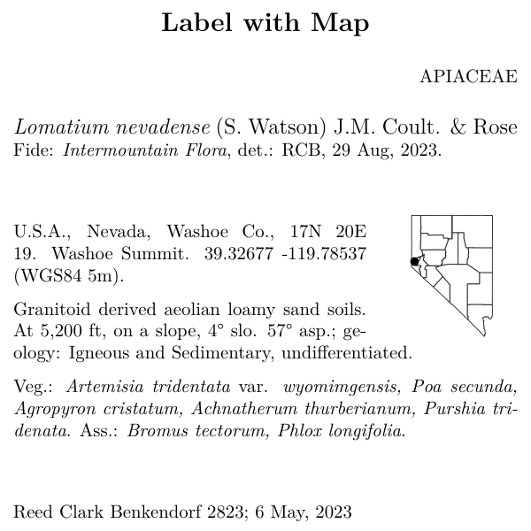

```{r setup, include=FALSE}
knitr::opts_chunk$set(eval = FALSE)
knitr::opts_chunk$set(message = FALSE)
knitr::opts_chunk$set(warning = FALSE)
```

## Overview 
Obviously, everyone wants to be able to customize their label templates! 
Why go through the bother of installing and running `BarnebyLives` if you cannot do that!  

This section is on writing labels for research collections.

Note that the labels are made using LaTeX, an awesome guide for LaTeX (relevant to the level you will be using it at) is [Overleaf.org](https://www.overleaf.com/learn/latex/Learn_LaTeX_in_30_minutes), and check the links in the side bar too! 

This vignette assumes you were able to get through `Custom Label Templates`. 

## Prepare workspace

```{r load libraries and find labels, eval =F}
#devtools::install_github('sagesteppe/BarnebyLives')
library(BarnebyLives)
library(tidyverse)

local <- file.path(path.expand('~'), 'Documents', 'assoRted', 'Barneby_Lives_dev', 'LabelStyles')
l.nevadense <- collection_examples |>
  filter(Collection_number == 2823) |>
  mutate(
    Project_name = 'Research Notes', 
    Coordinate_uncertainty = '+/- 5m', 
    Notes = 'Permit No.: XXXXX from Agency ZYX, Date: XX.XX.2025. Collected under NSF XXXXX, "catchy project name". DNA extracted from silica gel dried leaf tissue (additional material in ZYX biorepository) accession No.: XXXXX. Sequences available on NCBI SRA as PRJXYZYXYXY.'
    )

write.csv(l.nevadense, file.path(local, 'SoS-ExampleCollection.csv'), row.names = F)
```

Label templates can be copied from their original locations to a more common directory for a user to interface with.

```{r copy a template to a local directory, eval = F}
p2lib <- file.path(
  system.file(package = 'BarnebyLives'),
  'rmarkdown', 'templates', 'labels', 'skeleton'
  )

# here we copy over one of the skeletons which we are going to modify in this example
file.copy(
  from = file.path(p2lib, 'skeleton-research.Rmd'), 
  to = file.path(local, 'skeleton-research.Rmd'), 
  overwrite = FALSE
  )
```


```{r actually render labels, echo = F, eval = F}
purrr::walk(
  .x = l.nevadense$Collection_number,
  ~ rmarkdown::render(
    input = file.path(local, 'skeleton-research.Rmd'), 
    output_file = file.path(local, paste0('research', glue::glue("{.x}.pdf"))), 
    params = list(Collection_number = {.x}) 
  )
)
```

## glimpse at the label skeleton

and you will then end up with 

  
<br>

